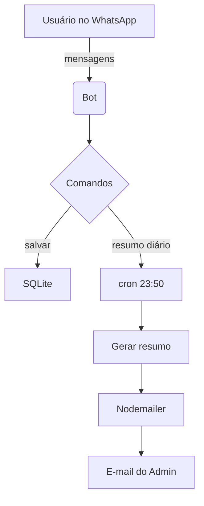

# Whats-17-06

Bot de WhatsApp em Node.js voltado para registro de conversas e envio de resumos diários. Todas as mensagens são salvas em um banco SQLite (`data/messages.db`), o que facilita consultas e garante que os dados fiquem locais.

## Funcionalidades principais

- **Integração com o WhatsApp** através da biblioteca `whatsapp-web.js` com autenticação `LocalAuth`.
- **Comandos básicos**: responde `!ping` com `pong` e envia o resumo de pendências quando recebe `!pendencias` do administrador definido em `WHATSAPP_ADMIN_NUMBER`.
- **Comando `!resumo-hoje`**: gera um resumo do dia atual ou de uma data informada (DD/MM/YYYY) e envia para o administrador.
- **Gerenciador de comandos**: cada comando é um módulo em `src/commands`, carregado dinamicamente na inicialização.
- **Armazenamento de mensagens**: registros em banco SQLite (`data/messages.db`), via `src/database.js`.
- **Sessão persistente**: autenticação usando `LocalAuth` com dados salvos em `session_data/`.
- **Resumos automáticos**: tarefa `cron` diária (16:00 BRT por padrão) que salva as conversas e dispara um e-mail.
- **Envio de e-mail**: `nodemailer` configurado para Gmail envia resumos completos ou apenas pendências.
- **Suporte a múltiplos administradores** via `ADMIN_WHATSAPP_IDS` (lista separada por vírgulas).
- **Análise de mensagens**: `src/summarizer.js` usa `sentiment` e heurísticas para identificar sentimento, tópicos e perguntas sem resposta.
- **Servidor Express** para health check em `/health` (porta `8080` por padrão).
- **Logs estruturados**: `winston` com rotação diária em `logs/`.
- **Qualidade garantida**: ESLint, Prettier e testes unitários com Jest.
## Fluxo Simplificado




## Estrutura do repositório

```
src/index.js         - Inicializa o cliente WhatsApp e agenda o resumo diário
src/summarizer.js    - Analisa mensagens e gera resumos gerais ou de pendências
src/emailer.js       - Envio de e-mails com os resumos gerados
src/logger.js        - Configuração de logs com Winston e rotação diária
src/database.js      - Persistência das mensagens em SQLite
src/scripts/test-summary.js  - Script para testar o envio de e-mail
src/__tests__/       - Testes automatizados com Jest
src/commands/        - Comandos organizados de forma modular
session_data/        - Pasta onde o WhatsApp salva a sessão
data/                - Arquivos do banco de dados SQLite
COMMANDS.md          - Referência rápida dos comandos do bot
Dockerfile           - Imagem Node para execução em contêiner
DEPLOYMENT_FIX.md    - Instruções para corrigir erro de branch em plataformas de deploy
INSTRUCOES_DEPLOY.md - Passo a passo de configuração na Coolify
.eslintrc.jsonc      - Regras básicas do ESLint
```

## Comandos do Bot

- `!ajuda` – lista todos os comandos disponíveis.
- `!ping` – responde "pong" para verificar se o bot está online.
- `!pendencias` – envia ao administrador um resumo de perguntas sem resposta do dia.
- `!resumo-hoje` – gera um resumo das conversas de uma data ou intervalo (ex.: `!resumo-hoje 01/02/2024 05/02/2024`).
- `!todos` – menciona todos os participantes de um grupo.
- `!test-email` – dispara um e-mail de teste para validar as credenciais.
- `!buscar` – pesquisa mensagens que contenham um termo especificado.
### Exemplos
```bash
!ajuda
!ping
!pendencias
!resumo-hoje 01/02/2024 05/02/2024
!todos
!test-email
!buscar pedido
```

## Configuração

Crie um arquivo `.env` baseado em `.env.example` com as variáveis abaixo:

```
WHATSAPP_ADMIN_NUMBER=5548920023834@c.us
ADMIN_WHATSAPP_IDS=5548920023834@c.us,5548999931227@c.us
DEFAULT_SUMMARY_DAYS=7
DAILY_SUMMARY_CRON=0 16 * * *
WHATSAPP_NOTIFY=false
EMAIL_USER=josemarschieste84@gmail.com
EMAIL_PASS=uiydrinsudkzsuqi
EMAIL_TO=schieste87@gmail.com
# Porta usada pelo servidor Express opcional
PORT=8080
```
O valor de `WHATSAPP_ADMIN_NUMBER` define quem pode usar o comando `!pendencias`.
A variável `ADMIN_WHATSAPP_IDS` contém uma lista de administradores separados por vírgula. O primeiro da lista recebe o resumo diário e pode usar `!resumo-hoje`.
O `DEFAULT_SUMMARY_DAYS` controla quantos dias entram no resumo diário automático.
`PORT` permite escolher a porta do endpoint `/health` usado para monitorar o bot.
Caso nao possua o Chrome instalado, mantenha o arquivo `.npmrc` com `puppeteer_skip_chromium_download=false` para que o Puppeteer baixe o Chromium automaticamente.
`DAILY_SUMMARY_CRON` permite ajustar o horário da tarefa de resumo sem alterar o código.
Com `WHATSAPP_NOTIFY` ajustado para `true`, o bot enviará o resumo para o WhatsApp do administrador além do e-mail.
Para que o envio de e-mails funcione é necessário criar uma senha de aplicativo no Gmail e habilitar o acesso às APIs necessárias.

## Executando localmente

1. Instale as dependências:
   ```bash
   npm install
   ```
2. Inicie o bot:
   ```bash
   node src/index.js
   ```
   Na primeira execução será exibido um QR Code no terminal para autenticação.

Durante o desenvolvimento você pode utilizar `npm run dev` (com `nodemon`) para recarregar o bot automaticamente. Os testes unitários podem ser executados com `npm test`.

## Utilizando Docker

O repositório inclui um `Dockerfile` pronto para execução. Para construir e rodar localmente:

```bash
npm run docker:build-local
npm run docker:run-local
```
Se preferir executar o comando manualmente, utilize a sintaxe abaixo (útil em sistemas Linux/macOS):

```bash
docker run -it --rm \
  -v "$(pwd)/auth_data:/app/auth_data" \
  -v "$(pwd)/logs:/app/logs" \
  --name meu-bot-local meu-bot-whatsapp-local:latest
```

## Gerando resumos manualmente

Para testar o envio de e-mails sem precisar aguardar o agendamento, execute:

```bash
node src/scripts/test-summary.js
```
Você também pode gerar um resumo do dia pelo WhatsApp enviando o comando `!resumo-hoje`.

## Testes

Execute os testes unitários com:

```bash
npm test
```

Para verificar o padrão de código e formatação, utilize:

```bash
npm run lint
```

## Considerações adicionais

- Os arquivos `DEPLOYMENT_FIX.md` e `INSTRUCOES_DEPLOY.md` contêm instruções específicas de deploy para plataformas como Coolify.
- Todo o código principal agora está organizado dentro do diretório `src/`.
- Caso deseje personalizar as regras de estilo, utilize os arquivos `.eslintrc.jsonc` e `.prettierrc`.
- O horário do resumo pode ser alterado ajustando a variável `DAILY_SUMMARY_CRON` no `.env`.

# Versão 1.2

## Deploy no Coolify

1. No painel da Coolify, acesse sua aplicação.
2. Em "Configuration" escolha **Dockerfile** como método de build e mantenha a branch `main`.
3. Salve e clique em **Deploy**.

Se ocorrer algum erro mencionando `nixpacks` ou `nix-env`, verifique se o passo acima está configurado corretamente.
